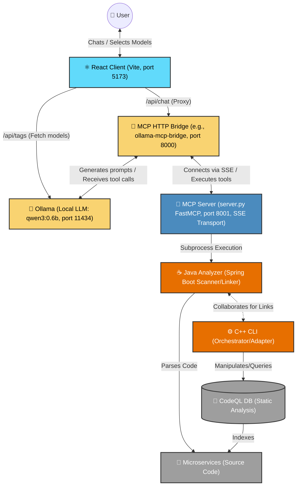

# API Guard System Architecture

This document describes the high-level architecture of the complete API Guard ecosystem, from the foundational code analysis engines up through the user-facing AI chat application.

## High-Level Architecture Diagram

## Components Breakdown

### 1. React Application (`react-ollama-client`)
The user-facing chat interface built with React and Vite. It provides a visual UI for the user to chat with the LLM, parse Markdown responses, and select the desired local model from a dropdown. It uses Vite's proxy to route requests to the backend architecture without encountering CORS issues.

### 2. Ollama (`qwen3:0.6b` / `llama3.2`)
The local Large Language Model (LLM) engine running on port `11434`. Ollama is responsible for understanding user intent, synthesizing answers, and, crucially, requesting function calls (tools) when it determines it needs to query the microservice architecture. The React app talks to Ollama directly (via the proxy) for model discovery (`/api/tags`).

### 3. MCP HTTP Bridge (`ollama-mcp-bridge`)
Since Ollama does not natively resolve or orchestrate Model Context Protocol (MCP) tools autonomously via its REST API, an intermediate bridge (running on port `8000`) is utilized. This bridge listens for OpenAI-compatible or Ollama-compatible `/api/chat` requests from the React frontend, proxies them to Ollama, and automatically intercepts and executes any `tool_calls` the LLM requests against the downstream MCP Server.

### 4. MCP Server (`server.py`)
A Python-based FastMCP server listening on port `8001` via Server-Sent Events (SSE). It defines the specific tools that the LLM is allowed to execute (e.g., `list_services`, `get_service_details`, `find_incoming_calls`). When the bridge invokes a tool, `server.py` executes the Java Analyzer as a subprocess, collects the JSON output, and returns it to the bridge.

### 5. API Guard Java Analyzer
A robust Java tool (`api_guard`) that acts as a Scanner and Linker. It parses Spring Boot projects and microservices source code, extracting configuration paths, Feign clients, HTTP methods, and service dependencies to construct a comprehensive JSON map of producers and consumers.

### 6. C++ CLI Adapter
A high-performance C++ command-line interface (`cli/api_guard/main.cpp`) responsible for orchestrating analysis workflows and adapting `.trap` files for CodeQL databases.

### 7. CodeQL Database
A relational database representation of the microservices source code. It is utilized for deep, semantic static analysis queries by the core architectural components.